# DLP lab 4

## Introduction
In lab4, we use the Conditional Variational Autoencoder (CVAE) to predict video frames. The CVAE model is trained to predict the next frame given the previous frames and the human pose. To generate the whole video, the model then uses the predicted frame as the input for the next prediction.

To train the model to predict the next frame with the context of the current frame, we need a latent variable that represents the information that is not present in the current frame. We use a posterior predictor to predict the posterior distribution of the latent variable given the current frame and the human pose. Then, we use the predicted posterior distribution to sample the latent variable, which is used to predict the next frame.

Then, we trained the model with the previous frames, the current frame human pose, and the sampled latent variable to predict the next frame.
The training objective is to minimize the KL divergence between the predicted posterior distribution and the true posterior distribution, and the MSE loss between the predicted frame and the true frame.

In order to avoid KL vanishing, we use the KL annealing strategy to increase the KL weight during training. Additionally, to prevent the model from using wrong information from the previous frames, we use the teacher forcing strategy to control the ratio of using the true frames or the predicted frames as inputs.


## Implementation details

### Training protocol
#### 1. Training
During the training phase, we take the previous frame, current pose, and current frame to predict the current frame and the posterior distribution. The training objective is to minimize the reconstruction(MSE) loss of the predicted frame, also the KL divergence between the predicted posterior distribution and the true posterior distribution N(0, 1).
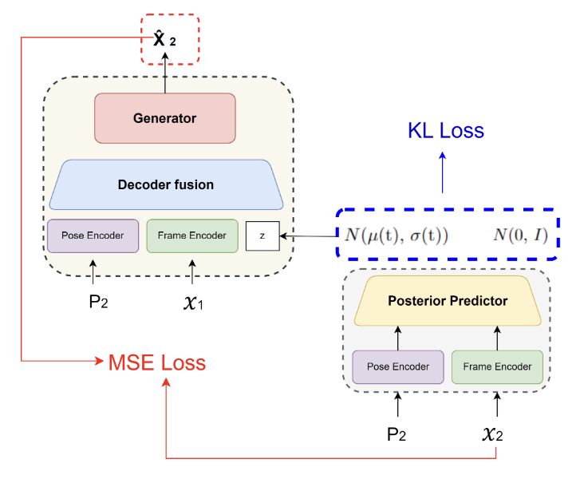

Below is the code for training one step of the model. 
Additionally, the teacher forcing technique and the KL annealing strategy are implemented in the training loop. Those will be discussed in the following sections. 
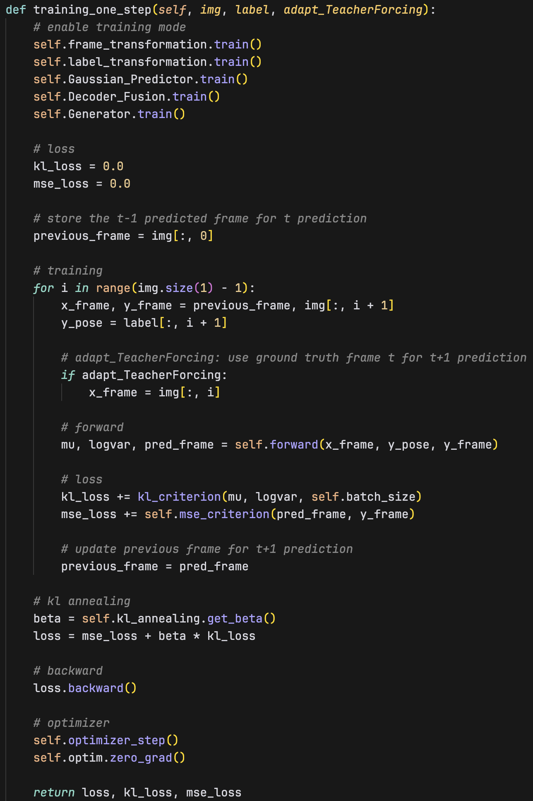

The forward propagation of the model is shown in the figure below. The forward function takes the previous frame, the current pose, and the current frame as inputs. First, the current pose and frame are passed through the encoder (_**frame transformation**_, _**label transformation**_).
Second, the outputs of the encoder are passed through the posterior predictor (_**Gaussian Predictor**_) to predict the mean and the log variance of the posterior distribution. 
Third, the previous frame is passed through the frame encoder (_**frame transformation**_). And given the sampled latent variable, the encoded previous frame, and the encoded pose, the decoder (_**Decoder Fusion**_) predicts the next frame.
Finally, the forward function returns the predicted frame and the predicted posterior distribution (defined by _**mu**_ and _**logvar**_). The _**mu**_ and _**logvar**_ are used to calculate KL divergence loss, and the predicted frame is used to calculate the MSE loss.
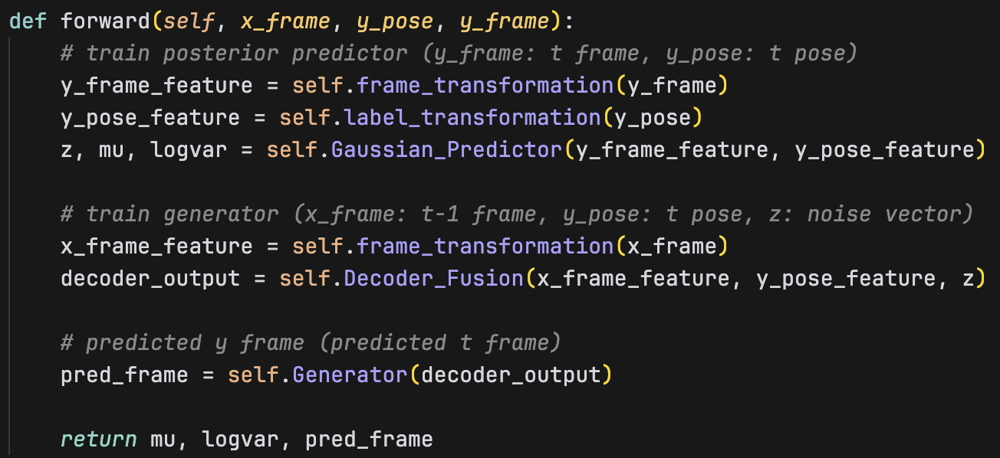

#### 2. Inference
For the testing (inference) phase, we take the previous frame, current pose, and sample from the normal distribution to predict the current frame. The testing objective is to predict the current frame given the previous frame and the current pose. And in order to generate the subsequent frames to form a whole video, the predicted frame is used as the input for the next prediction recursively. 
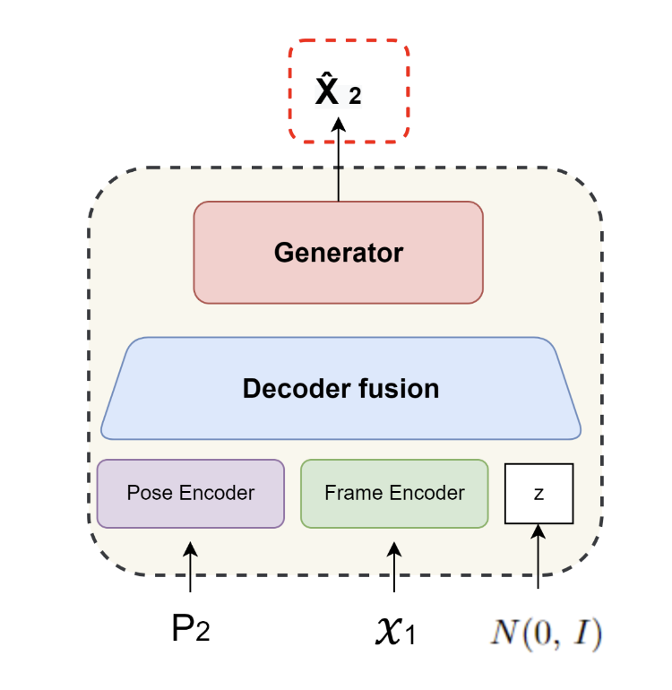

Below is the code for testing (validating) one step of the model.
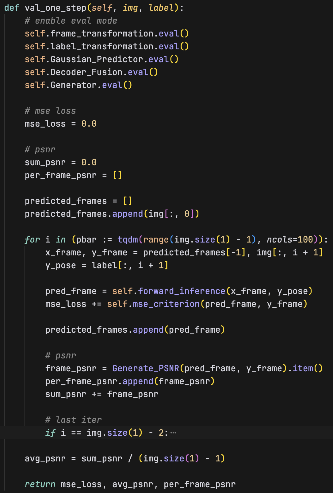

The forward propagation when inferencing is shown in the figure below. The forward inference function takes the previous frame, the current pose as inputs. First, the z noise vector is sampled from the normal distribution. 
Second, the current pose and frame are passed through the encoder (_**frame transformation**_, _**label transformation**_).
Third, the encoded previous frame, the encoded current pose, and the sampled latent distribution are fed into the decoder (_**Decoder Fusion**_) to predict the current frame.
Finally, the forward inference function returns the predicted frame.
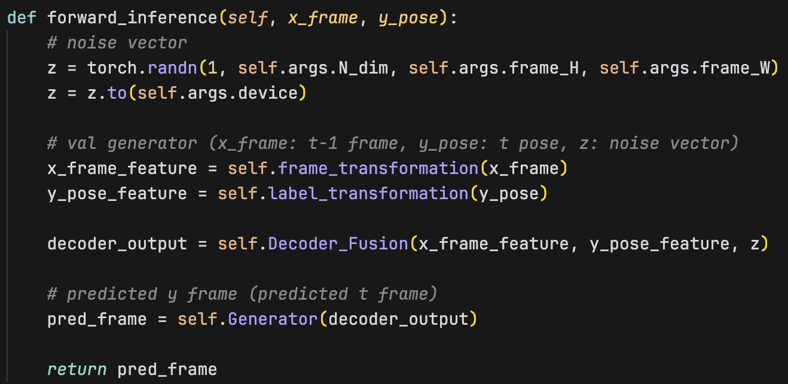


### Reparameterization trick
During training, the model samples the latent variable from the predicted posterior distribution. However, directly sampling from the distribution makes this operation non-differentiable. In order to backpropagate, we need to make this operation differentiable. To do this, we use a method called the reparameterization trick.

After the posterior predictor predicts the mean and the log variance, we sample a random variable from the standard normal distribution. Then, we turn the normal distribution into the predicted posterior distribution by scaling and shifting the random variable with the mean and log variance given by the posterior predictor. And this detaches the schotasticity from the network, making the entire model differentiable.

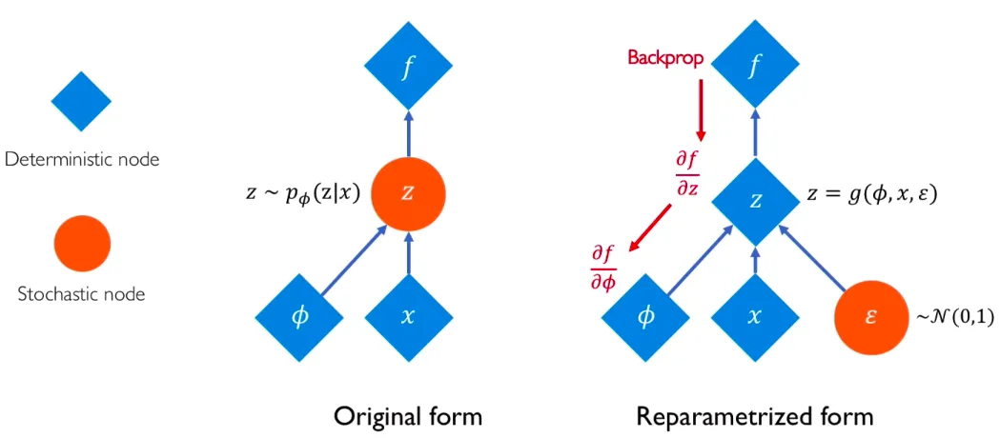

Here is the code snippet that implements the reparameterization trick in the model.
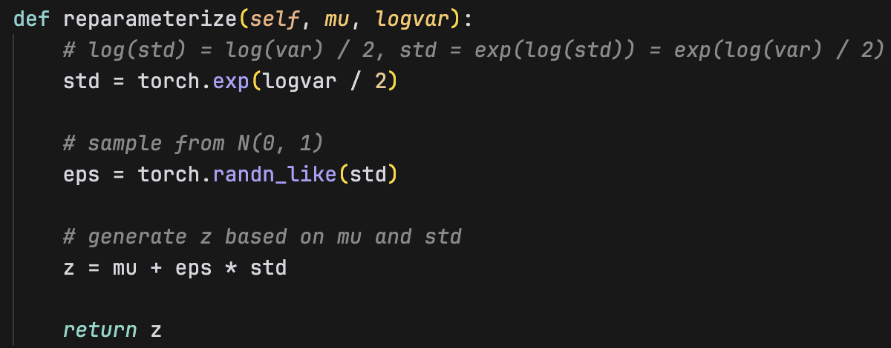

### Teacher forcing strategy
Since the model is trained to predict the next frame recursively, during one training step, it uses the predicted frame as the input for the next prediction. However, the predicted frame may contain errors, which will be propagated to the next prediction. To prevent the model from using wrong information from the previous frames, the teacher forcing strategy is introduced to control the ratio of using the true frames or the predicted frames as inputs.
The teacher forcing ratio can be configured with the arg parameter `tfr`, and the `tfr_sde` parameter controls when the teacher forcing ratio starts to decay. Additionally, `tfr_d_step` controls how much the teacher forcing ratio decays each step after `tfr_sde` epoch.

During each training epoch, we decide whether to use the teacher forcing strategy with the following code snippet. 

```python
adapt_TeacherForcing = True if random.random() < self.tfr else False
```

If the random number is less than the teacher forcing ratio, we use the true frame as the input for the next prediction. Otherwise, we use the predicted frame as the input. This is shown in the figure below.
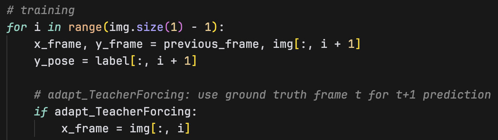

After each epoch, we decay the teacher forcing ratio with the following code snippet if the epoch exceeds the `tfr_sde` parameter.
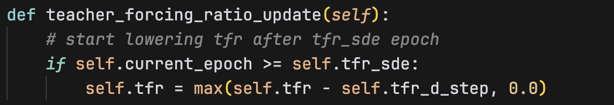


### KL annealing
In the beginning of the training, the KL loss is usually large, and if the KL loss is directly added to the total loss, it may dominate the total loss and prevent the model from learning the reconstruction loss. To prevent this, we use the KL annealing strategy to gradually increase the KL weight during training. This helps the model to focus on the reconstruction loss in the beginning and explore the latent space more freely. And as the training progresses, the KL weight gradually increases, and the model starts to focus more on the KL loss.
There are two types of KL annealing strategies implemented in this experiment: the monotonic KL annealing strategy and the cyclical KL annealing strategy. Also, there is a setting without KL annealing strategy.

When calculating the total loss, the KL loss is multiplied by a `beta` value.
```python
loss = mse_loss + beta * kl_loss
```

After each epoch, the beta value is updated based on the selected KL annealing strategy. The monotonic KL annealing strategy increases the beta value monotonically, and the cyclical KL annealing strategy periodically resets the beta value to a small value. This is shown in the figure below.

Specifically, the monotonic strategy calls the frange_monotonic function on every epoch update. The function increases the beta value by the number of epochs multiplied by the increment ratio. The increment ratio is calculated with by the final ration divided by the number of epochs it takes to reach the final ratio.

For the cyclical strategy, the frange_cyclical function is called on every epoch update. The function increases the beta value by the stage the epoch is currently in (which is the epoch mod cycle length) multiplied by the increment ratio.
The mod operations helps reset the beta value to the initial ratio if the epoch is a multiple of the cycle length.

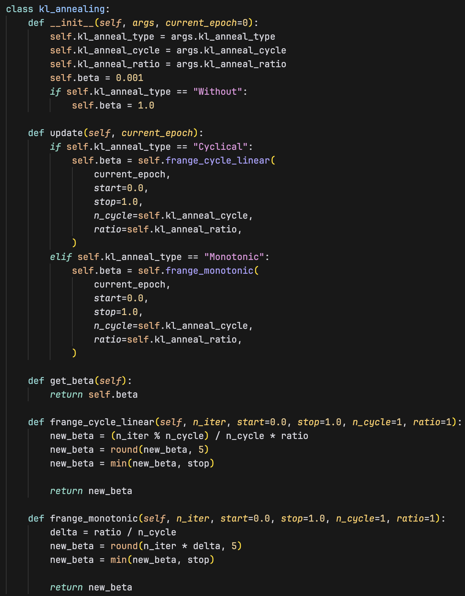

## Analysis amd Discussion

### Plot Teacher forcing ratio
In this experiment, the KL annealing is disabled to test the effect of the teacher forcing ratio independently. 
First, the teacher forcing ratio is set to 0.0, which means the model always uses the predicted frame as the input for the next prediction. 
Second, the teacher forcing ratio is set to 1.0, `tfr_sde` is set to 10, and `tfr_d_step` is set to 0.1. This means the teacher forcing ratio starts to decay after 10 epochs and decays 0.1 each epoch.

The teacher forcing ratio and the loss curve are plotted in the figures below.
We can see that, for the tfr enabled run, once the teacher forcing ratio starts decaying, the loss curve starts to increase. This is because the model starts to use the predicted frame as the input, which contains errors.
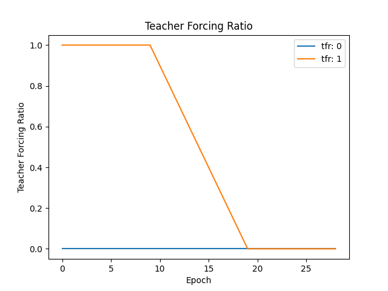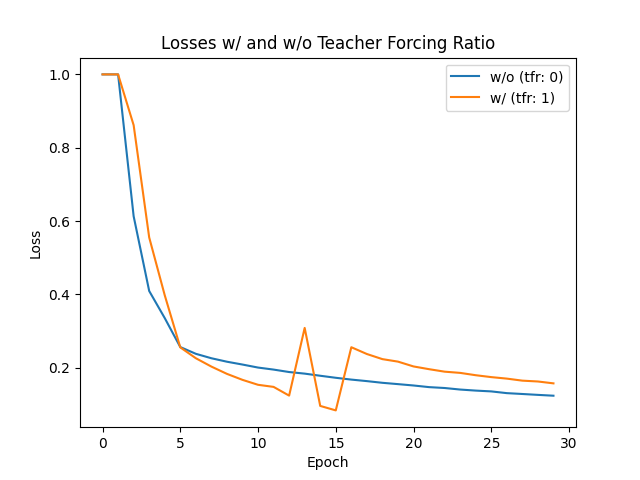

If we compare the average PSNR-per-frame on the validation dataset, we can see that the model with the teacher forcing ratio of 0.0 performs better than the model with the teacher forcing ratio of 1.0.

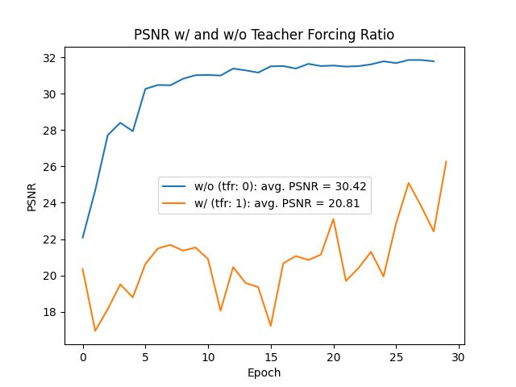

### Plot Loss curves with different settings
For this experiment, as the previous experiment suggested, we use tfr = 0.0 to compare the performance of the model with different KL annealing strategies.

Below is the beta value curves with different KL annealing strategies.
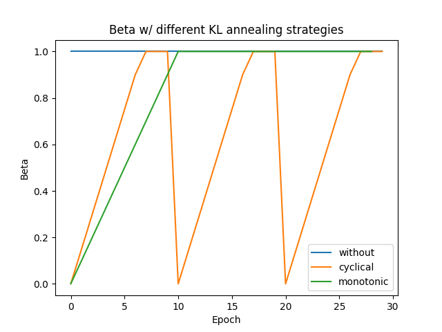

Below is the loss and PSNR curves with different KL annealing strategies. We can see that the cyclical KL annealing strategy and the monotonic KL annealing strategy both perform better than the without KL annealing strategy.

Comparing the **monotonic/cyclical** KL annealing strategy with the **without** KL annealing strategy:
We can see that the without KL annealing strategy starts with an extremely large loss, comparing to strategies like cyclical or monotonic. This is because the KL loss is usually large in the beginning, and without any kind of KL annealing strategy, the KL loss is directly added to the total loss. On the otherhand, the cyclical and monotonic KL annealing strategies start with a small loss. This is because the KL loss is multiplied by a `beta` value, wich is a small value in the beginning. This helps the model focus on the reconstruction loss more and explore the latent space more freely in the beginning. And as the training progresses, the `beta` value gradually increases. The model begin to focus more on the KL loss, which helps the model to learn better latent representations.

Comparing the **monotonic** KL annealing strategy with the **cyclical** KL annealing strategy:
The monotonic strategy performs similar to the cyclical strategy in this case. But, generally, I think monotonic will perform worse than the cyclical strategy. This is because the monotonic strategy increases the KL weight monotonically. And if the KL loss dominates the total loss too quickly, the model may neglect the reconstruction loss. On the otherhand, the cyclical strategy periodically resets the KL weight to a small value, which helps the model refocus on the reconstruction loss. Nevertheless, they both perform well in this case.

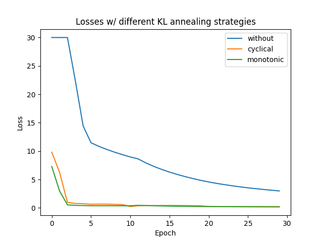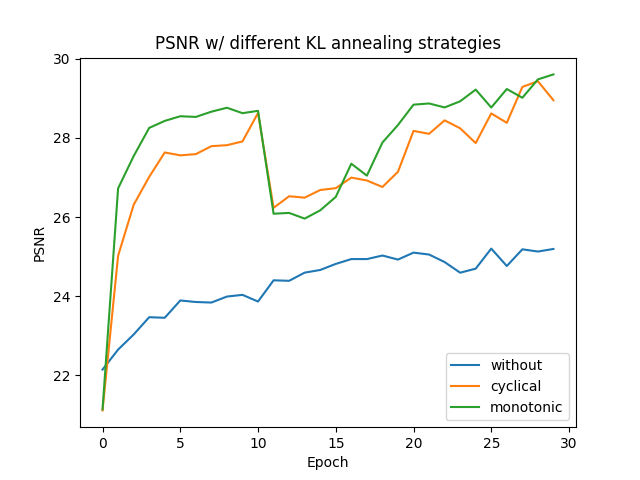
<small>(p.s. The loss values are clamped to a maximum of 30 for better visualization)</small>


### Plot PSNR-per-frame on validation dataset
As per the discussion above, the cyclical KL annealing strategy performs better than the monotonic KL annealing strategy and the without KL annealing strategy. The cyclical KL annealing strategy achieves the highest PSNR-per-frame on the validation dataset.

**Monotonic KL annealing**
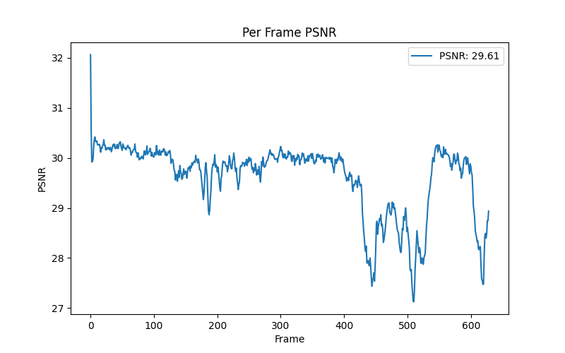

**Cyclical KL annealing**
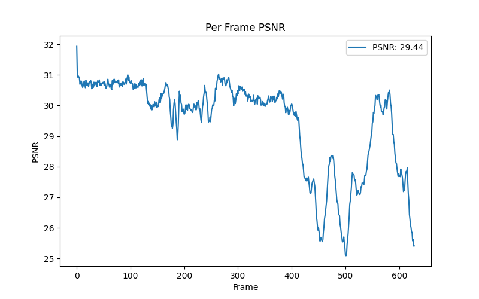

**Without KL annealing**
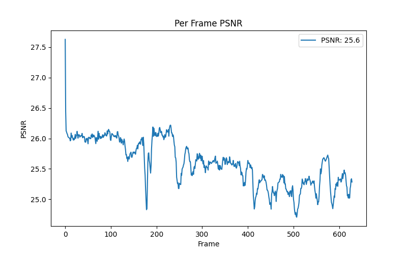

We can see that, under the same other settings, the cyclical KL annealing strategy performs better than the monotonic KL annealing strategy and the without KL annealing strategy.

### Other training strategies
#### Setting `fast_train_epoch` equal to the total **`num_epoch`**
Originally, the model is trained with `fast_train_epoch` for 10 epochs, and a total of 30 epochs.
Later, I tried training the model using `fast_train` entirely, that is, the `fast_train_epoch` is set as the total number of epochs. And I noticed a performance gain with the all fast train setting.

I think this is because, in both settings, I disabled the teacher forcing ratio, which means the model always uses the predicted frame as the input for the next prediction. And this propagates the error to the next prediction.

If the model is trained using the full data, then it might be quite hard for it to predict good quality frames in the later frames. The reason being that the later frames accumulate too much error, and it is hard for the model to predict next frame well given the accumulated error.

However, if the model is trained using only a small portion of the data, then when the model is predicting the later frames, it has less accumulated error to start with, thus it might be easier for the model to predict well.

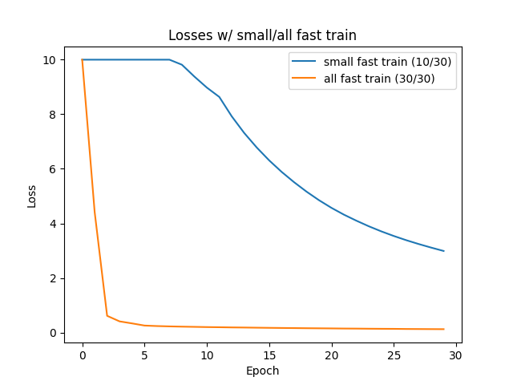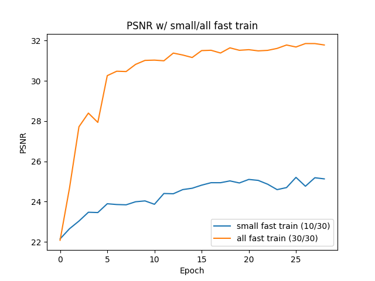
<small>(p.s. The loss values are clamped to a maximum of 10 for better visualization)</small>

#### Best validation PSNR
In the end, I'm able to achieve the best validation PSNR-per-frame (32.01) by using the without KL annealing strategy along with the all fast train setting.

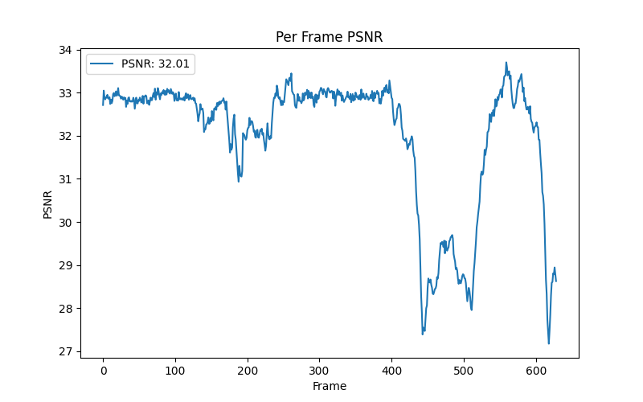

## Derive the Conditional VAE formula
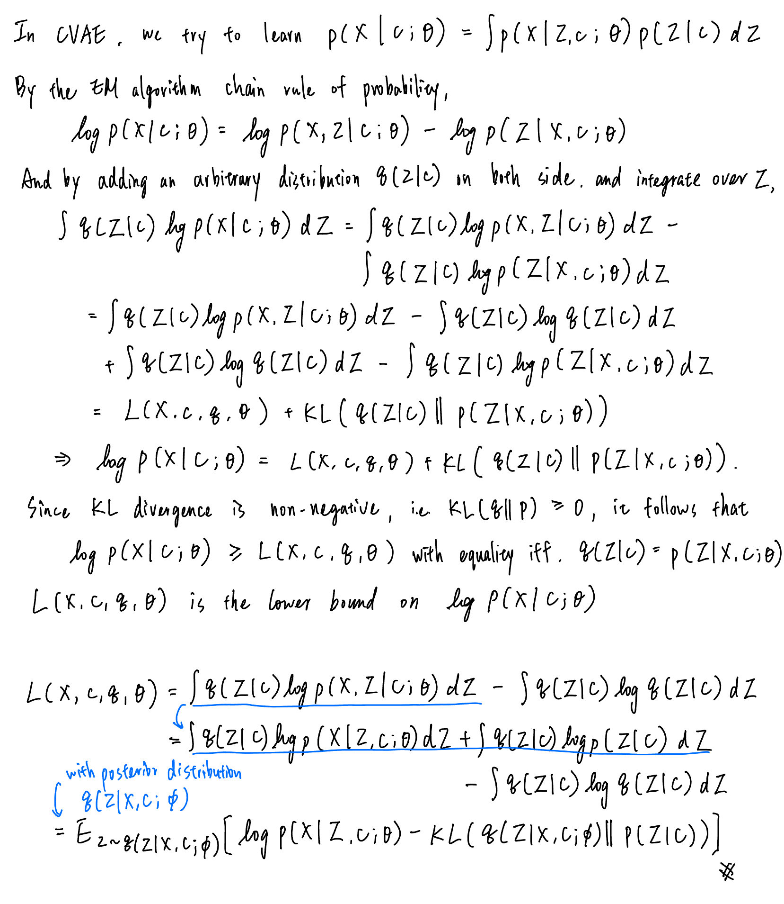